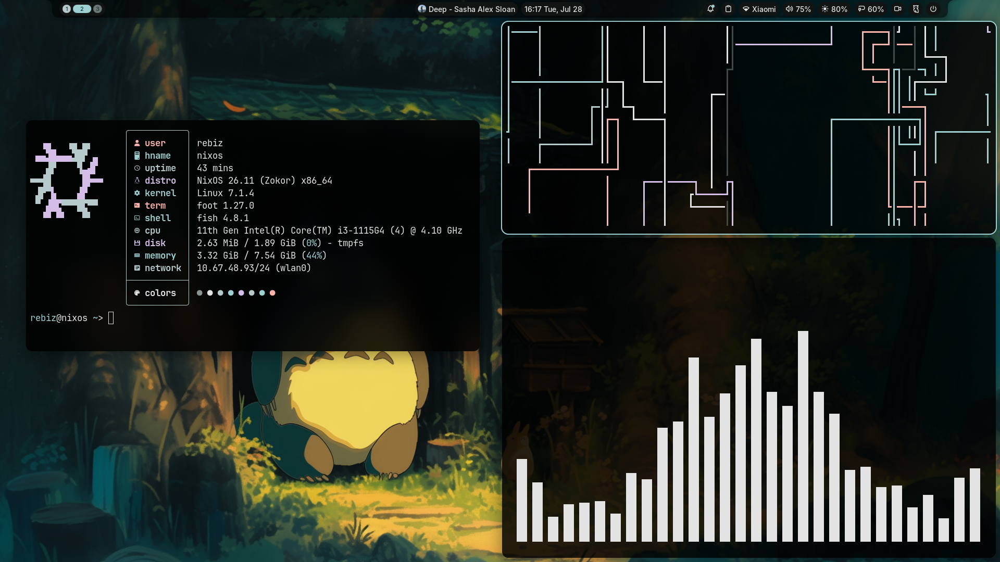

# NixOS Config

My personal NixOS setup for laptop. Uses a `tmpfs` root partition (wiped on every reboot) with opt-in persistence (`preservation`) for `/persistent` and `/home`.



## Tech Stack

- **OS:** NixOS (unstable)
- **WM:** [Niri](https://github.com/YaLTeR/niri) (scrollable tiling Wayland compositor)
- **Bar / Shell:** [Noctalia](https://github.com/noctalia-dev/noctalia)
- **Greeter:** Noctalia Greeter
- **Browser:** Brave Origin (debloated, locked-down policies)
- **Terminal:** Foot + Fish shell (`zoxide`, `eza`, `bat`, `ripgrep`)
- **Editor:** Nano (configured via Home Manager with syntax highlighting)
- **Secrets:** [sops-nix](https://github.com/Mic92/sops-nix) with `age` keys

## Directory Structure

```
.
├── flake.nix               # Flake entrypoint (flake-parts + import-tree)
├── assets/                 # Wallpapers and avatar image
├── secrets/                # sops-nix encrypted secrets
└── modules/
    ├── hosts/              # Hardware and machine configs (laptop)
    ├── system/             # System modules (boot, display, hardware, services)
    └── home/               # Home-Manager modules (apps, shell, theming)
```

## Installation

1. Boot NixOS installer and connect to Wi-Fi (`iwctl`).
2. Clone repo:
   ```bash
   nix-shell -p git -- git clone https://github.com/rebizzz/nixos /tmp/nixos
   cd /tmp/nixos
   ```
3. Run Disko to partition:
   ```bash
   sudo nix run github:nix-community/disko/latest -- --mode disko --flake .#laptop
   ```
4. Copy backup age key:
   ```bash
   sudo mkdir -p /mnt/persistent/etc/sops/age
   sudo cp /path/to/keys.txt /mnt/persistent/etc/sops/age/keys.txt
   sudo chmod 600 /mnt/persistent/etc/sops/age/keys.txt
   ```
5. Install and reboot:
   ```bash
   sudo nixos-install --flake .#laptop --no-root-passwd
   sudo reboot
   ```
