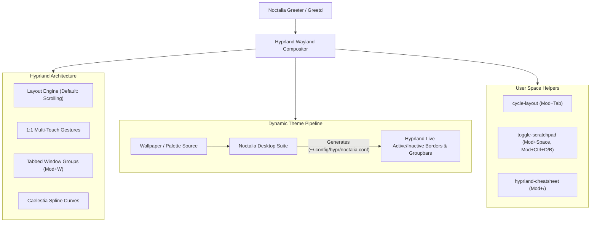

# Hyprland Desktop Environment Architecture & User Guide

A declarative, high-performance Wayland desktop configuration on NixOS using **Hyprland**, **Noctalia**, and **Home Manager**.

---

## 1. Overview & Architecture

The desktop stack runs on `laptop` ("Rebiz") using upstream Hyprland packages managed via [hyprnix](https://github.com/hyprwm/hyprnix) and [hyprland-contrib](https://github.com/hyprwm/contrib).



---

## 2. Directory Structure

```
modules/home/desktop/hyprland/
├── default.nix       # Home Manager module entrypoint & helper scripts
├── _general.nix      # Autostart (dex, dbus), environment variables, noctalia.conf source
├── _layout.nix       # Scrolling layout (default), dwindle, and master configurations
├── _appearance.nix   # 12px rounding, 3-pass blur, drop shadows, and tabbed groupbar styling
├── _animation.nix    # Caelestia cubic bezier curves and window/layer/workspace animations
├── _input.nix        # Keyboard repeat, touchpad natural scroll/tap, and 3-finger workspace gestures
├── _output.nix       # Display configurations with VRR (Variable Refresh Rate) enabled
├── _rules.nix        # Window rules (Satty, Discord, Brave, Steam, Noctalia) & layer blur rules
└── _binds.nix        # Complete keybinds, media controls, grouping, zoom, and scratchpads
```

---

## 3. Keybindings Reference

> Press **`Super + /`** anytime in Hyprland to pop up the interactive cheatsheet!

### Applications & Launchers
| Keybinding | Action |
|---|---|
| `Super + Return` | Open Terminal (`kitty`) |
| `Super + D` | Application Launcher (`noctalia msg panel-toggle launcher`) |
| `Super + B` | Web Browser (`brave-origin --new-window`) |
| `Super + E` | File Manager (`thunar`) |
| `Super + /` | Interactive Cheatsheet (`hyprland-cheatsheet`) |
| `XF86Calculator` | Quick Calculator Panel |

### Layout & Workspaces
| Keybinding | Action |
|---|---|
| `Super + Tab` | **Cycle Layout** (`Scrolling` $\rightarrow$ `Dwindle` $\rightarrow$ `Master`) with notification |
| `Super + O` | Noctalia Overview / Workspace Panel |
| `Super + 1..9` | Switch to Workspace `1` through `9` |
| `Super + Ctrl + 1..9` | Move Focused Window to Workspace `1` through `9` |
| `Super + Ctrl + Shift + 1..9` | Move Window to Workspace Silently |
| `Super + Ctrl + Down / Up` | Move to Next / Previous Workspace |

### Window Management & Scrolling Layout
| Keybinding | Action |
|---|---|
| `Super + Q` | Close Active Window |
| `Super + T` | Toggle Floating Mode |
| `Super + F` | Toggle Fullscreen Mode |
| `Super + M` | Toggle Maximize Mode |
| `Super + C` | Center Window on Screen |
| `Super + Shift + C` | Fit Focused Column into View |
| `Super + R` | Cycle Column Width Preset (`0.25` $\rightarrow$ `0.33` $\rightarrow$ `0.5` $\rightarrow$ `0.67` $\rightarrow$ `0.75` $\rightarrow$ `1.0`) |
| `Super + ,` / `Super + .` | Swap Focused Column Left / Right |
| `Super + -` / `Super + =` | Shrink / Expand Focused Column Width |

### Navigation & Focus
| Keybinding | Action |
|---|---|
| `Super + H` / `Super + L` | Focus Window Left / Right |
| `Super + J` / `Super + K` | Focus Window Down / Up |
| `Super + Shift + H` / `L` | Move Window Left / Right |
| `Super + Shift + J` / `K` | Move Window Down / Up |

### Window Grouping & Tabs
| Keybinding | Action |
|---|---|
| `Super + W` | **Toggle Window Group** (turns window into a tabbed group or ungroups) |
| `Super + Shift + W` | **Lock / Unlock Active Group** |
| `Super + Alt + J` / `Super + Alt + L` | Next Tab in Group |
| `Super + Alt + K` / `Super + Alt + H` | Previous Tab in Group |
| `Super + Ctrl + H / J / K / L` | Move Focused Window into Adjacent Group (Left / Down / Up / Right) |
| `Super + Ctrl + E` | Eject Window out of Current Group |

### Scratchpads (Special Workspaces)
| Keybinding | Action |
|---|---|
| `Super + Space` or `Super + \`` | **Toggle Manual Scratchpad** (`special:scratchpad`) |
| `Super + Shift + Space` | Send Focused Window to Manual Scratchpad |
| `Super + Ctrl + D` | **Toggle Discord Scratchpad** (auto-launches Discord if not running) |
| `Super + Shift + D` | Move Active Window to Discord Scratchpad |
| `Super + Ctrl + B` | **Toggle Brave Scratchpad** (auto-launches Brave if not running) |
| `Super + Shift + B` | Move Active Window to Brave Scratchpad |

### Screen Magnifier / Zoom
| Keybinding | Action |
|---|---|
| `Super + Z` | Zoom In (1.5x) |
| `Super + Shift + Z` | Reset Zoom (1.0x) |
| `Super + Ctrl + =` | Zoom In (2.0x) |
| `Super + Ctrl + -` | Reset Zoom (1.0x) |

### Screenshots & Session
| Keybinding | Action |
|---|---|
| `Print` | Interactive Region Screenshot (`noctalia msg screenshot-region`) |
| `Ctrl + Print` | Fullscreen Screenshot |
| `Shift + Print` | Area / Window Screenshot |
| `Super + Alt + L` | Lock Screen |
| `Super + Shift + Q` | Power / Session Menu |
| `Ctrl + Alt + Delete` | Quit Hyprland Session |

---

## 4. Touchpad & Multi-Touch Gestures

- **3-Finger Horizontal Swipe**: Smooth 1:1 Workspace switching.
- **3-Finger Swipe Down/Up**: Fast directional workspace navigation.
- **Mouse Drag Window**: Hold `Super + Left Mouse Button` to drag floating windows.
- **Mouse Resize Window**: Hold `Super + Right Mouse Button` to resize floating windows.
- **Mouse Wheel Navigation**: `Super + Scroll Up/Down` to cycle focus across columns.

---

## 5. Animation Curves (Caelestia Splines)

Animations are matched with Caelestia's Material Design 3-inspired cubic bezier curves:

- `specialWorkSwitch`: `[0.05, 0.7, 0.1, 1.0]`
- `emphasizedAccel`: `[0.3, 0.0, 0.8, 0.15]`
- `emphasizedDecel`: `[0.05, 0.7, 0.1, 1.0]`
- `standard`: `[0.2, 0.0, 0.0, 1.0]`

Window open/close transitions use `popin 87%` and `slidefadevert 15%` for special workspace drop-downs.

---

## 6. Noctalia Theming Pipeline

Noctalia dynamically writes color configurations to `~/.config/hypr/noctalia.conf` whenever your wallpaper or color palette changes. Hyprland automatically includes this file to update:
- Active border gradient (`col.active_border`)
- Inactive border color (`col.inactive_border`)
- Groupbar tab headers and locked borders
- Shell UI elements and blur effects

---

## 7. Rebuilding & Applying Changes

Rebuild your system cleanly using `nh` or standard NixOS commands:

```bash
# Rebuild and activate desktop configuration
nh os switch

# Or with nixos-rebuild
sudo nixos-rebuild switch --flake .#laptop
```
