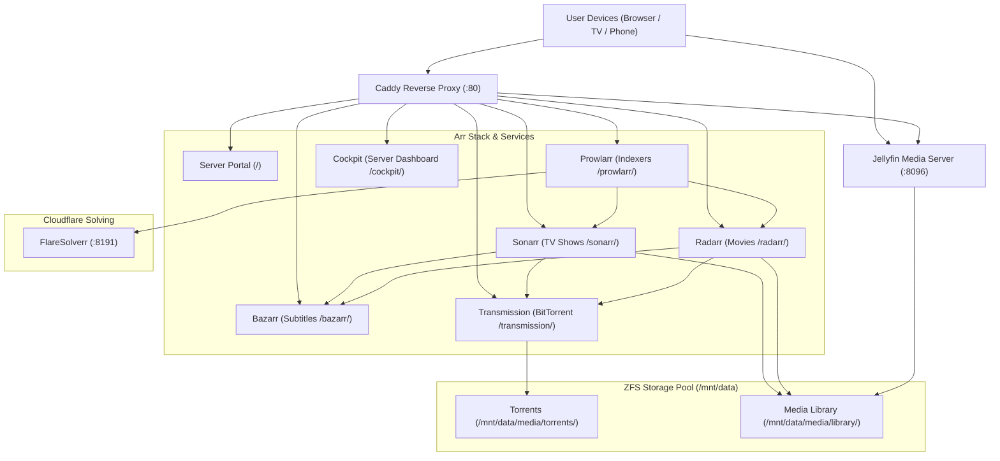

# Nixarr Media Server Stack Setup & Architecture Guide

A fully declarative, zero-touch media automation stack deployed on `nixos-server` ("Fern") using [Nixarr](https://github.com/rasmus-kirk/nixarr), [Caddy](https://caddyserver.com/), and native NixOS services.

---

## 1. Overview & Architecture

The stack runs entirely on `nixos-server` behind a unified reverse proxy with automated indexer synchronization, download management, metadata scraping, subtitle fetching, Cloudflare challenge bypassing, and instant Jellyfin media indexing.



---

## 2. Directory Layout & Storage

All persistent media and state files reside on the ZFS storage pool at `/mnt/data`:

```
/mnt/data/
├── media/
│   ├── library/               # Processed media library for Jellyfin
│   │   ├── movies/            # Radarr root folder (Movies)
│   │   ├── shows/             # Sonarr root folder (TV Series & Anime)
│   │   ├── music/
│   │   ├── books/
│   │   └── audiobooks/
│   └── torrents/              # Active download scratch space
│       ├── tv-sonarr/         # Sonarr download category
│       ├── movies-radarr/     # Radarr download category
│       ├── sonarr/
│       ├── radarr/
│       ├── .incomplete/       # In-progress torrent chunks
│       └── .watch/            # Auto-load .torrent files
└── storage/
    └── .state/nixarr/         # SQLite databases & persistent app configs
        ├── sonarr/
        ├── radarr/
        ├── prowlarr/
        ├── jellyfin/
        ├── transmission/
        ├── bazarr/
        └── secrets/           # Extracted API keys (*.api-key)
```

### Declarative Permissions
The entire directory tree is declaratively created via `systemd.tmpfiles.rules` with mode `2775` (`drwxrwsr-x`) and `setgid` owned by group `media`. This guarantees that `transmission`, `sonarr`, `radarr`, and `jellyfin` share full read/write permissions for every downloaded file without permission collisions.

---

## 3. URLs & Service Endpoints

All web interfaces are accessible on your local network on standard port `80` (no port numbers required):

| Service | Local URL | Port (Backend) | Purpose |
| :--- | :--- | :--- | :--- |
| **Server Portal** | **`http://nixos-server.local/`** | `80` | Unified web landing page |
| **Jellyfin** | **`http://nixos-server.local/web/`** | `8096` | Media streaming for Movies & TV |
| **Sonarr** | **`http://nixos-server.local/sonarr/`** | `8989` | TV Series & Anime automation |
| **Radarr** | **`http://nixos-server.local/radarr/`** | `7878` | Movie collection automation |
| **Prowlarr** | **`http://nixos-server.local/prowlarr/`** | `9696` | Indexers & trackers manager |
| **Transmission** | **`http://nixos-server.local/transmission/web/`** | `9091` | BitTorrent download client |
| **Bazarr** | **`http://nixos-server.local/bazarr/`** | `6767` | Subtitles manager |
| **Cockpit** | **`http://nixos-server.local/cockpit/`** | `9090` | Linux server management & stats |
| **FlareSolverr** | *Internal (`127.0.0.1:8191`)* | `8191` | Cloudflare Turnstile & captcha bypass |

---

## 4. Automated 1-Deploy Architecture

The configuration in [`modules/system/services/nixarr.nix`](../modules/system/services/nixarr.nix) and [`caddy.nix`](../modules/system/services/caddy.nix) includes complete zero-touch automation:

1. **Universal Reverse Proxy**:
   - Caddy hosts the portal on exact `/` (`@portal path /`), proxies dedicated subpaths (`/sonarr/`, `/radarr/`, `/prowlarr/`, `/transmission/`, `/bazarr/`, `/cockpit/`), and automatically falls through to Jellyfin (`handle { reverse_proxy 127.0.0.1:8096 }`) for all 60+ Jellyfin API routes, websockets, and streaming streams.
2. **Pre-Configuration Hook (`nixarr-preconfigure.service`)**:
   - Automatically injects `<UrlBase>` and `<AuthenticationRequired>DisabledForLocalAddresses</AuthenticationRequired>` into `config.xml` files on initial boot.
3. **Self-Healing Sync Units**:
   - `sonarr-sync-config`, `radarr-sync-config`, `prowlarr-sync-config`, and `bazarr-sync-config` have `Restart = "on-failure"`, a 5-second backoff, and a 120-second timeout to guarantee API keys are generated and synced smoothly on cold boot.
4. **Zero-Seed & Automated Cleanup**:
   - Transmission is configured with `ratio-limit = 0` and `idle-seeding-limit = 0` to halt seeding the moment downloads reach 100%.
   - Sonarr & Radarr have `removeCompletedDownloads = true` to immediately delete finished torrents from Transmission upon successful import into the media library.
5. **Native FlareSolverr Service**:
   - Runs headless Chromium on `127.0.0.1:8191` and automatically handles Cloudflare Turnstile / anti-bot challenges for Prowlarr indexers.
6. **Cockpit Reverse Proxy**:
   - Configured with `UrlRoot = /cockpit` and allowed port 80 origins to prevent 403 Forbidden errors.

---

## 5. Maintenance & Useful Commands

### Deploy Updates to Server
```bash
just server-apply
```

### Check Service Health
```bash
ssh rebiz@nixos-server.local "systemctl status caddy jellyfin sonarr radarr prowlarr transmission bazarr cockpit flaresolverr"
```

### View Live Logs
```bash
# FlareSolverr challenge logs
ssh rebiz@nixos-server.local "journalctl -u flaresolverr.service -f"

# Sonarr / Radarr sync logs
ssh rebiz@nixos-server.local "journalctl -u sonarr -u radarr -f"

# Transmission logs
ssh rebiz@nixos-server.local "journalctl -u transmission.service -f"

# Caddy access logs
ssh rebiz@nixos-server.local "journalctl -u caddy.service -f"
```
